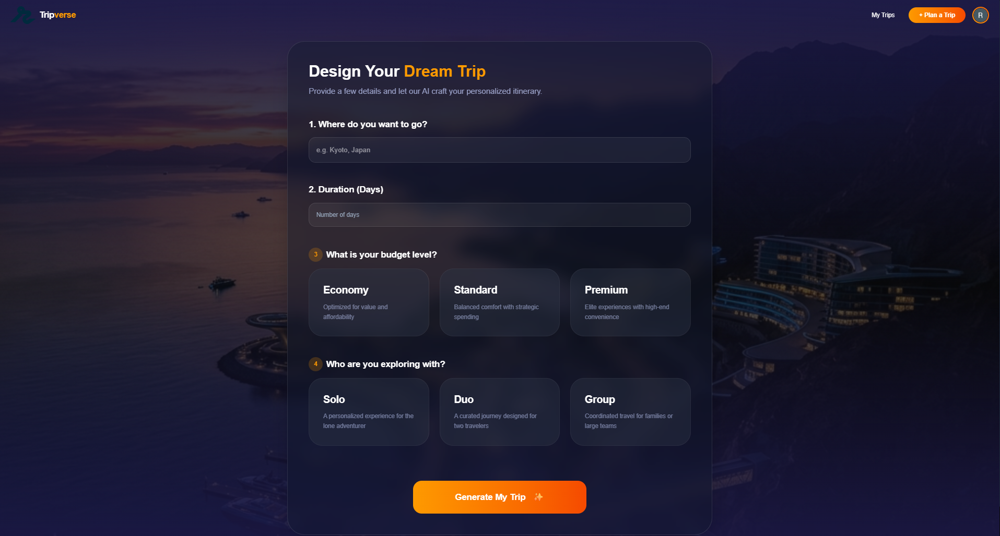
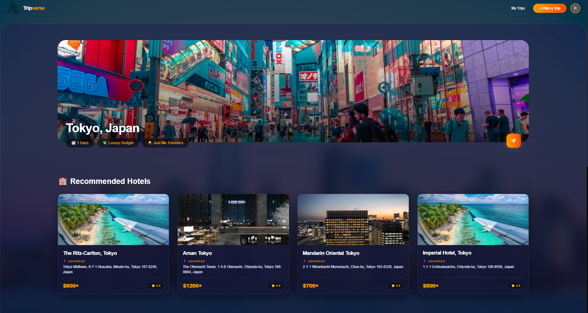
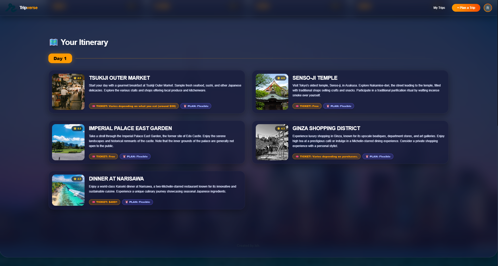
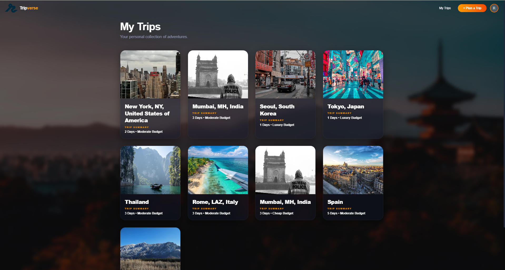
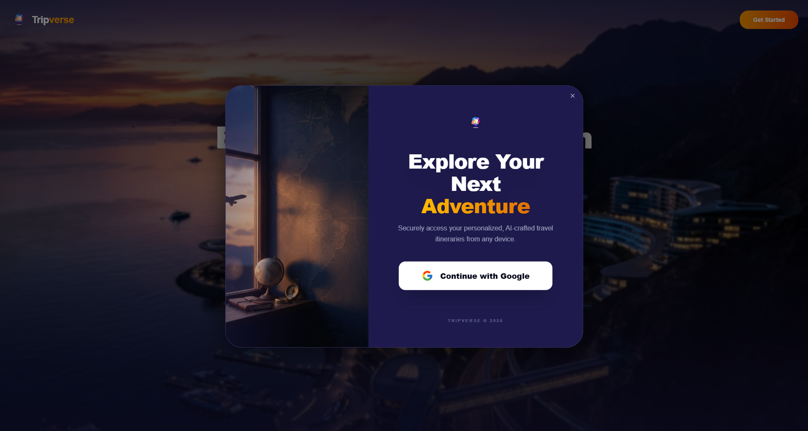

# 🌅 Tripverse: AI-Powered Travel Architect

**Tripverse** is a premium, state-of-the-art travel planning application that leverages the power of Google's Gemini AI to craft high-precision, cinematic travel itineraries. Designed with a "Twilight Adventure" aesthetic, it combines elegant glassmorphism with high-performance AI logic to turn your travel dreams into detailed reality.


## ✨ Features

- **🧠 Intelligent Itinerary Generation**: Powered by `gemini-1.5-flash`, the app generates multi-day plans based on your destination, duration, and personal travel style (Solo, Duo, Group).
- **🏨 Premium Hotel Curations**: Get AI-recommended hotels featuring price estimates, ratings, and addresses.
- **🗺️ Precision Map Integration**: Every location in your itinerary is linked directly to Google Maps with enhanced query precision.
- **🔒 Secure Google Authentication**: Seamless login and trip saving using Google OAuth.
- **🗂️ Travel Dashboard**: A dedicated "My Trips" suite to manage and revisit all your past AI-crafted adventures.
- **🌅 Twilight Premium UI**: A sophisticated design system featuring Deep Indigo backgrounds, Sunset Gold accents, and advanced glassmorphism components.

## 🛠️ Tech Stack

- **Frontend**: React.js, Tailwind CSS v4, Vite
- **AI Engine**: Google Generative AI (Gemini SDK)
- **Backend/DB**: Firebase Firestore
- **Authentication**: Google OAuth 2.0
- **APIs**: Unsplash (Imagery), Geoapify (Geocoding)
- **Notifications**: Sonner

## 🚀 Getting Started

### Prerequisites

- Node.js (v18+)
- npm or yarn
- A Google AI Studio API Key (Gemini)
- A Firebase project and web config
- A Geoapify API Key

### Installation

1. Clone the repository:
   ```bash
   git clone https://github.com/ishwari-03/Tripverse.git
   ```
2. Install dependencies:
   ```bash
   npm install
   ```
3. Create a `.env` file in the root directory and add your credentials:
   ```env
   VITE_GOOGLE_CLIENT_ID=your_google_client_id
   VITE_GEMINI_API_KEY=your_gemini_api_key
   VITE_GEOAPIFY_KEY=your_geoapify_key
   VITE_FIREBASE_API_KEY=your_firebase_key
   # Add other Firebase config fields here
   ```
4. Start the development server:
   ```bash
   npm run dev
   ```

## ScreenShots

### Landing Page


### Plan A Trip


### View Trip



### My Trips


### Login


---
